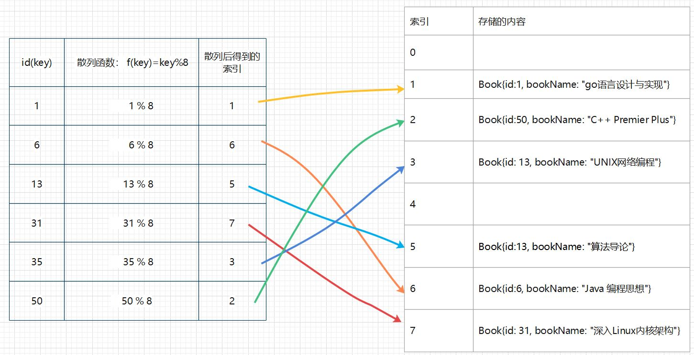
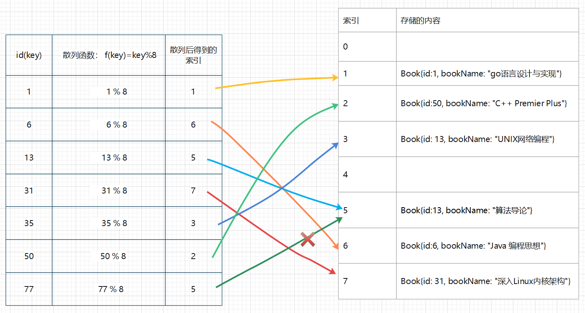

# 1.  什么是hash table?

`hash table`，中文一般翻译为`哈希表`，百度百科给出的定义是：

> 根据关键码值（Key value）而直接进行访问的数据结构。通过把关键码值映射到表中某一个位置来访问记录，以加快查找的速度。这个映射函数叫做“散列函数”，存放记录的数组叫做“散列表”。

# 2. 为什么要讨论hash table?

作为高频面试题，网络上有关`hash table`的讨论已经非常非常多了。一方面，在日常编程中我们需要处理`Key-Value`形式的数据的场景非常常见；另一方面，面试中面试官考察`hash table`方面的问题，可以详细了解候选人对一门编程语言底层的实现方式有多深入地了解。

笔者在看`golang`源代码的过程中，想要深入了解一下`hash table`的实现原理。但是翻遍网上的文章，不是互相拷贝的博客，就是语焉不详，不够深入的文章。秉着“死磕到底”的精神，笔者翻阅大量中英文博客、书籍和源代码，梳理了这篇文章，希望能通过这篇文章阐明其他博客中没有覆盖到的详细细节。

# 3.  为什么要用`hash table`?

程序就是数据和算法。要处理数据，首先要存储数据。 当我们想要在程序中（实际是内存中）存储一个数据时，我们可以声明一个变量，比如`C`语言的做法：`int a = 10;` 但是有时候，我们想要处理**一组**数据，而非一个数据，这个时候可以使用数组，比如：`int arr[5]={1, 2, 7, 3, 5}`

数组的本质是：**以数组下标作为索引，存储的一组数据。换言之，通过下标这个索引，我们可以直接访问到想要的元素**。

但是这还不够。

假设我们在程序中定义了这样一个类型：

```c
struct Book{
    int id;
    char bookName[100];
}
```

如果我们有100个Book类型的数据需要存储，应该怎么办？有同学说：“很好办，我申请一个100长度的数组就可以了”。

```c
Book books[100];
```

没有问题。但是当我们想要在 `books`里面查找时，就很麻烦。 我想要找`id=1301`的`book`时，不得不遍历一遍`books`数组，并逐个检查`id`是否等于1301才能确定当前找到的`book`是不是我要找的`book`.

有没有更好的办法？ 另外一个同学说：“这个简单，这不就是key-value的一组数据嘛。我把id作为key, 把bookName作为value存起来就好了”。

是的，但即使`key-value`这件看起来如此地简单明了的事情，在编程语言中也是经历了非常长的时间才被大众广泛接受的。 今天的编程语言可以非常方便的使用 `map`(golang)、`dict`（python）、`HashMap`(java)来存储`key-value`格式的数据。但是也要意识到： 直到今天`C`语言中依然没有一个内置的字典类型。如果你想在`C`语言的代码里存储一组`key-value`格式的数据，你不得不自己动手实现一个字典类型或者用其他trick的方式来替代（[参考stackoverflow上的讨论](https://stackoverflow.com/questions/14731939/store-known-key-value-pairs-in-c)）。

# 4. `hash table`的原理

那么`hash table`的底层是如何实现的？

## 4.1 `hash table`基本原理

还用上面提到的`books`为例子来说。 现在我想要把一组数据存储到程序中。这组数据有两列：

|  id  | bookName          |
| :--: | :---------------- |
|  1   | go语言设计与实现  |
|  6   | Java 编程思想     |
|  13  | 算法导论          |
|  31  | 深入Linux内核架构 |
|  35  | UNIX网络编程      |
|  50  | C++ Premier Plus  |

`hash table`的构成要素有两个：`散列函数f`和存储数据的`散列表`。

在我们的例子中,`id`作为了**关键码值**。 为了讨论问题的简化，我们先暂时假设散列函数f是：`f(key) = key % 8`，散列表是一个长度为8的数组。 可以得到下面的映射关系：



左侧的散列表是一个长度为8的数组。其中存储的元素并不是`bookName`，而是一个` book{}`对象，这里面包含了`id`和`bookName`。

当要查找一个`id=50`的book时，只需要根据`f(key)= 50 % 8 = 2`定位到散列表中下标为2的元素，然后取出这个元素，根据`book.id==50`来判断当前取到的元素是否确实是我们在查找的元素。

> Q: 这种存储方式的优点是什么？
>
> A: 因为是直接通过key计算出元素在散列表中的位置，所以可以直接访问你要的元素。查找元素的时间复杂度是`O(1)`

> Q: 这种存储方法的缺点呢？
>
> A： 1. 有额外的空间开销，比如上面下标为0和4的位置没有元素。
>
> ​	   2. 因为要把不确定数量的 key映射到一个有限空间上去，散列函数可能有冲突。

> Q： 散列函数的冲突是怎么回事？
>
> A： 看下面一个例子。

假设我们要在上面这个散列表中继续存入新的数据。如果新的数据的key,也就是id经过散列函数后得到的下标刚好是0或者4,就能继续插入新的元素直至把整个散列表存满。但是实际情况并不那么理想，如果下一个要存入的数据的id是77怎么办？



因为`77 % 8 = 5`，但是访问散列表中下标为5的位置发现已经有元素了，这时候77这个元素就没法在这里插入了。

怎么办？

处理散列函数冲突一般有下面几种方法：

1. 开放定址法（再哈希法）
2. 二次探测法（Quadratic Probing）
3. 拉链法 （链地址法/ chaining）
4. 临近槽 （using neighbouring slots ）
5. 公共溢出区法 （overflow areas）

别着急，我们一个一个解释。

## 4.2 开放定址法

开放定址法的原理可以用下面的公式来表达：$H_i = (H(key) + d_i) \%\ S$ （ H: 哈希函数   S: 散列表数组的长度    $d_i$：增量序列）

按照$d_i$的取值不同，分为以下几种：

$d_i$ : 1, 2, 3, ..., m-1，这种方法称为线性探测再散列

$d_i$: $\pm1^2$,  $\pm(2)^2$, $\pm(3)^2$, ..., $\pm(k)^2$ ，这种方法称为二次探测再散列

$d_i$：伪随机序列，这种方法称为伪随机探测再散列

$H_i=RH_i(key)$, $i=1, 2, 3, ..., k  $ .  重复再散列，如果$H_i(key)$的值有冲突，将$H_i(key)$的值作为新的key继续调用$H_i$进行散列，即：$H(H(H...H(key)))$

## 4.3 拉链法

使用拉链法时，散列表中存储的元素不是book本身，而是一个链表的头节点。所有发生冲突的key都追加在链表中。


## 4.4 公共溢出区

假设哈希函数的值域为[0,m-1]，则设散列表[0...m-1]为基本表，每个分量存放一个记录，另设立一张表[0....v]为溢出表。

所有关键字和基本表中关键字为同义词的记录，不管他们由哈希函数得到的哈希地址是什么，一旦发生冲突，都填入溢出表。

# 5 `hash table`的评价指标

`hash table`的优势在于快速访问元素。所以在`hash table`中查找一个元素的平均查找次数就是衡量它的重要指标。如何分析这个指标？

首先想到的是，如果哈希函数发生冲突的概率很高，那么它的查找性能肯定很差。哈希函数发生冲突的概率取决与哈希函数本身的设计，根据你要存储的数据集设计一个尽可能好的哈希函数来避免冲突。

其次，在哈希函数发生冲突时，采用怎样的策略也会对查找性能有影响。

#### 5.1 哈希函数对`hash table`的影响

1. 哈希函数要尽可能简单。如果哈希函数非常复杂，哈希计算的开销就会比较大，计算每一个key的索引就需要更多的CPU操作，这显然会影响`hash table`的查找性能。
2. 哈希函数的结果要尽可能地分散/随机，以避免发生碰撞。如果经常发生碰撞，就不可避免地要做额外地操作来解决碰撞：如果是使用拉链法就需要在链表中追加结点。如果使用开放地址法，就需要重新计算一次哈希值。这都会引入额外的开销。
3. 哈希函数是幂等性的。 对于同一个关键码值(key)，进行多次哈希计算必须得到相同的结果。如果同一个key的第一次哈希和第二次哈希指向不同的索引，就没办法保证在查找时能够准确命中散列表中存储的元素。

> Q: 幂等性是什么？
>
> A： 幂等是一个数学概念，其特点是：任意多次执行所产生的影响均与一次执行的影响相同。调用一个函数得到的结果，与调用无数次这个函数得到的结果应当相同。

> Q: 我在实现hash table的时候，哈希函数是给定的，因为我的散列表长度是提前设定的。只要哈希函数确定了，就肯定是幂等啊。这还能有不幂等的情况？
>
> A：有的。考虑这种情况，我自己实现了一个hash table，散列表长度为8. 但是随着数据增多，我的散列表满了，这时候不得不对散列表扩容。比如我把散列表的长度扩展为17（2 * N + 1）.你原来的散列表中的元素要不要重新计算？ 如果不重新计算，你就必须还要使用旧的哈希函数。但旧的哈希函数只能把数据映射到[0,7]的区间，即使你增加了散列表长度，也不能向[8,16]这个区间添加数据，因为旧的哈希函数找不到这个区间。这意味： 随着散列表扩容，哈希函数一直在变化。

#### 5.2 冲突解决方法对`hash table`的影响

如果发生冲突，采用不同的解决冲突的策略也会对查找性能有影响。 需要特别说明的是：

1. 如果采用线性探测法/二次探测法，key容易发生聚集（clustering）。考虑这种情况：如果有大量的key在经过哈希函数后发生碰撞，大部分的key都需要经过线性再探测重新计算，但是因为线性探测/二次探测法的$d_i$的值是给定的，他们基本上在发生冲突的索引附近聚集。
2. 开放地址法可能加剧碰撞。比如$H(key)$计算得到的索引为5，但是散列表中5位置已经有元素，就需要重新探测下一位置，比如探测到下一位置为9，并在散列表中索引为9的位置保存该元素。但是如果$H(key2)$计算的索引刚好为9的话，就会发生冲突，这个冲突并不是因为哈希函数设计的不好导致的，而是因为另外一个key的再探测导致的。
3. 如果使用拉链法，发生冲突的key会在一个索引位置追加元素，从而将链表拉长。 拉链越长，每次查找时需要遍历的元素越多。极端情况，等同于你在一个单链表中逐个遍历元素的查找过程，查找性能会很差。

#### 5.3 散列表对`hash table`的影响

散列表是一个数组，如果你要存储的key-value数据非常多，而散列表本身比较小，在插入过程中就需要对散列表扩容，即使不了解扩容的细节，你可以想象地到扩容一个散列表会有多大的开销。

比如一个散列表原来的长度为100，其中存了75个数据。现在随着数据的插入，需要对散列表扩容，我们需要重新申请一个200长度的数据，然会对原来的75个数据逐个重新计算他们的索引值，然后拷贝到新的散列表中相应的位置。

因此在使用`hash table`时， 提前根据你要存储的数据量预先分配大小合适的散列表，以尽可能地避免散列表发生扩容。

# 6. 如何量化`hash table`的性能指标

衡量`hash table`性能的一个关键指标是装载因子$\alpha$  (load factor)。$\alpha = (已存储元素的个数)/(散列表的总长度)$. 

它反映了**当前散列表”满“的程度**。如果散列表越”满“,下一次插入/查找时发生冲突的概率越高，需要的开销也就越大。

在`Java`的实现中，默认的散列表长度为11, 装载因子$\alpha$最大为0.75。

随着插入数据的增多，$\alpha$增大。当$\alpha$大于0.75时，就会发生散列表的扩容。

$\alpha$越小意味着散列表的额外空间开销越大，因为散列表不够”满“，很多位置没有有效利用起来。

$\alpha$越大意味着发生碰撞的概率越大，向散列表中插入一个元素的开销越大，因为需要额外的操作来解决冲突。

`Java`将0.75当作$\alpha$的最大值，是基于泊松分布得出的一个接近最优的值，基本上能够平衡空间开销和碰撞概率两方面的利弊，使空间开销尽可能的小，碰撞概率也尽可能地小。

下面图给出了基于线性再探测和拉链法实现的散列表中，装载因子与查找次数的关系图。


# 7. `HashMap` vs `HashTable`


> Q： 为什么我看网上的博客讨论中，有`HashMap`，有`HashTable`？它们有什么区别？
>
> A： `HashMap`和`HashTable`都是`Java`提供的两个基础类。他们都基于`hash table`的原理来实现，都是用来存储key-value数据的。
>
> 针对Java来说，HashMap是非同步的，而`HashTable`是同步的。因此`HashMap`的性能会比`HashTable`更好。但是因为`Java`的`HashMap`是非同步的，你如果用多线程去操作`HashMap`就有并发风险。`HashTable`虽然性能差，但是每次操作都有锁的保护，所以不会有并发风险。
>
> `HashTable` 中不允许值为null的key和value。`HashMap`可以存储一个key为null的值和任意多个value为null的值。
>
> `HashTable`在Java 1.7中被废弃了，取而代之的是`ConcurrentMap `。 如果你想要一个可以存储key-value数据的类型，并且不会并发的使用它，你可以用`HashMap`，如果你需要并发地使用这个数据，可以使用`ConcurrentMap `。

**特别要说明的是：`Java`的`HashTable`指的是`Java`基础类库中提供的`HashTable`这个类。在本文中使用的`hash table`指的是`哈希表`这种抽象数据结构。**


# 8. 为什么并发会是个问题？

`Java` 的`HashMap`有严重的[并发问题](https://www.jianshu.com/p/4930801e23c8)。那么是不是只有`Java`的实现有问题？ 其他语言或者其他实现方法可不可以避免并发问题？

`go`的`map`类型如何处理并发问题？

首先`go`的`map`类型不是并发安全的。我们尝试下面的例子

```go
func main(){
	m := make(map[string]int)
	m["foo"] = 0
    
	var wg sync.WaitGroup
	wg.Add(2)
	
    go func(){
		for {
			m["foo"]++
		}
	}()

	go func(){
		for{
			fmt.Println(m["foo"])
		}
	}()
	wg.Wait()
}
```

这段代码会报错：

> fatal error: concurrent map read and map write

为何`go`的`map` 类型不是并发安全的？[官方给出的解释](https://golang.org/doc/faq#atomic_maps)是：

> ### Why are map operations not defined to be atomic?
>
> After long discussion it was decided that the typical use of maps did not require safe access from multiple goroutines, and in those cases where it did, the map was probably part of some larger data structure or computation that was already synchronized. Therefore requiring that all map operations grab a mutex would slow down most programs and add safety to few. This was not an easy decision, however, since it means uncontrolled map access can crash the program.
>
> The language does not preclude atomic map updates. When required, such as when hosting an untrusted program, the implementation could interlock map access.
>
> Map access is unsafe only when updates are occurring. As long as all goroutines are only reading—looking up elements in the map, including iterating through it using a `for` `range` loop—and not changing the map by assigning to elements or doing deletions, it is safe for them to access the map concurrently without synchronization.
>
> As an aid to correct map use, some implementations of the language contain a special check that automatically reports at run time when a map is modified unsafely by concurrent execution.

大概意思是： `map`在一般的应用场景中不需要并发安全。而在那些需要并发安全的场景里，`map`可能只是某个数据或计算过程的一部分，而这个数据或计算过程已经并发安全了（等于说：如果`map`有并发问题，并不是我`map`引入的问题，而是你上层的并发控制没做好）。同时这个语言本身并不排斥原子更新机制，如果你需要，可以通过内联锁(interlock)控制map的访问。为了帮助正确使用`map`，该语言的一些实现包含一个特殊的检查，当并发执行不安全地修改`map`时，该检查会在运行时自动报告。

这个特殊检查和报告机制，就是我们上面的代码提示`fatal error: concurrent map read and map write ` 的原因。

如果你真的需要并发安全的`map`可以通过读写锁来实现。

```go
type ConcurrentMap struct{
	sync.RWMutex
	Map map[string]int
}

func main(){
	m := make(map[string]int)
	m["foo"] = 1
	safeMap := ConcurrentMap{Map: m}

	var wg sync.WaitGroup
	wg.Add(2)

	go func(){
		for i:=0;i<10;i++ {
			safeMap.Lock()
			safeMap.Map["foo"]++
			safeMap.Unlock()
			time.Sleep(10)
		}
	}()

	go func(){
		for i:=0;i<10;i++{
			safeMap.Lock()
			fmt.Println(safeMap.Map["foo"])
			safeMap.Unlock()
			time.Sleep(10)
		}
	}()
	wg.Wait()
}
```

参考资料

[Hashing Out Hash Functions](https://medium.com/basecs/hashing-out-hash-functions-ea5dd8beb4dd)

[Java HashMap工作原理及实现]([https://yikun.github.io/2015/04/01/Java-HashMap%E5%B7%A5%E4%BD%9C%E5%8E%9F%E7%90%86%E5%8F%8A%E5%AE%9E%E7%8E%B0/](https://yikun.github.io/2015/04/01/Java-HashMap工作原理及实现/))

[HashMap并发问题](https://www.jianshu.com/p/4930801e23c8)

[Go: Map Design by Example — Part I](https://medium.com/a-journey-with-go/go-map-design-by-example-part-i-3f78a064a352)

[Go: Map Design by Code — Part II](https://medium.com/a-journey-with-go/go-map-design-by-code-part-ii-50d111557c08)

[Go: Concurrency Access with Maps — Part III](https://medium.com/a-journey-with-go/go-concurrency-access-with-maps-part-iii-8c0a0e4eb27e)

[浅谈 Golang 中数据的并发同步问题（三）]([https://jingwei.link/2019/05/12/golang-concurrency-03-map.html#%E4%B8%BA%E4%BB%80%E4%B9%88-map-%E5%B9%B6%E5%8F%91%E8%AF%BB%E5%86%99%E6%97%B6%E4%BC%9A%E5%9C%A8%E8%BF%90%E8%A1%8C%E6%97%B6%E5%BC%82%E5%B8%B8%E9%80%80%E5%87%BA](https://jingwei.link/2019/05/12/golang-concurrency-03-map.html#为什么-map-并发读写时会在运行时异常退出))