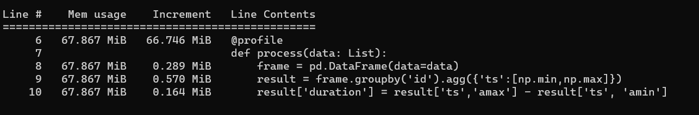
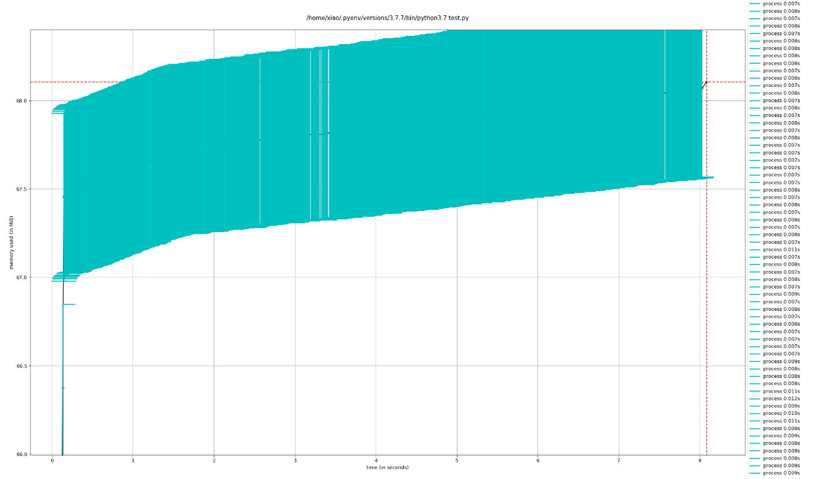

## 1. 问题定位

某天运维同学反映，我们部署在客户机房的服务器内存耗尽了，要求研发团队查一查原因。

因为这套服务是祖传“屎山”，内部耦合了许多业务，各种后台任务也是满天飞。趁这个机会，我把老的业务逻辑做了重新梳理，拆分出若干个独立的功能模块单独部署。 做完重构以后，整个系统清爽许多，问题也更容易定位。进一步的追查发现，有个用来计算坐标数据的模块内存一直线性增长，第一反应是：”完了，有内存泄漏！“。

这块业务的代码逻辑比较简单，剥离所有的业务代码后大致是这样子：

```python
"""
接受外部传入的若干组坐标数据,
坐标数据的格式为:  {x: "x坐标位置", y: "y坐标位置", id: "user_id", ts: "时间戳"}

将这几组数据加载到pandas.DataFrame中，
根据x,y 的坐标位置和一个预定义的分区网格进行匹配，计算id在网格内的停留时间
将停留时间存入数据库
"""
import pandas as pd

def process(data: List):
    frame = pd.DataFrame(data=data)
    result = frame.groupby('id').agg({'ts':[np.min,np.max]})
    result['duration'] = result['ts','amax'] - result['ts', 'amin']
    # save result to db
    # ...
```

在对代码做了多次剥离后，最终剩下了上面这一部分代码，看了一下，没发现问题。

找了一些测试数据灌进去开始profiling，发现内存确实在线性增长。可是上面核心代码只有三行，如果要发生内存泄漏很有可能发生在创建`DataFrame`的地方。

根据测试脚本对`process`函数进行5000次重复调用，通过`memory-profiler`统计程序的内存占用情况：



看一下内存占用曲线：



经过5000次调用，明显看到内存占用在逐渐增加。可以断定确实是这段代码造成的内存泄漏问题。

继续分析代码可以知道：发生内存分配的地方应该是`pd.DataFrame(data=data)。

## 2. 掉进`glibc`的坑

根据现在得出的情况经过一番google查到[相关的文章](https://shekharsingh.com/blog/2019/03/26/analyzing-pandas-memory-leak-issue-with-fix.html)。原来这个问题是`glibc` 中`free()`函数实现上的[bug](https://sourceware.org/bugzilla/show_bug.cgi?id=14827). `glibc`使用了`fastbin`结构，当`malloc()`分配的空间小于`M_MXFAST`时，`free()`不会对`fastbin`做剪切(trimming)。

> Q: `fastbin`是什么？
>
> A: `malloc`函数用来做内存分配，但是具体在分配时还有不同的内存分配策略。`glibc`中实现的内存分配方法基于 `dlmalloc()`和`ptmalloc()`，基本思路是将堆上的内存分为不同大小的内存块，每个块称为一个chunk。在内存分配/回收/切割时，对chunk进行操作。将几块内存空间用链表链接并管理起来称为`bins`，按照不同的性质分为`fastbin`、`unsorted bin`、`small bin`、`large bin`.其中`fastbin`包含的chunk大小分别为`16Bytes`、`24Bytes`、`32Bytes`、... `80Bytes` 。当你想要分配一块内存时，先检查`fastbin`中有没有满足你需要的大小的chunk，如果有直接使用这个chunk。如果没有，在堆上剪切出一块满足你大小的chunk给你使用。
>
> Q: `free()`操作如何回收内存？
>
> A:  `free()`函数先检查你要归还的这块内存大小是否满足`fastbin`的大小。如果满足，把这块内存放到`fastbin`中。如果不满足，将这块内存的指针转成普通的堆内存指针进行内存回收。

在明白了这些之后我们在看遇到的问题： 在发生问题的python代码中，我们每次循环调用都创建了一个新的`DataFrame` 。可以确定的是：在`pandas`的底层调用`glibc` 为数据分配内存时使用了一个很小的`chunk`。但是在释放时因为`glibc` 的问题没有正常释放，导致这个极小的内存碎片没法正确释放给操作系统，积少成多，造成严重的内存泄漏。

## 3. 解决方法

有什么解决方法？

1. 调用`python`的`gc`对内存进行回收。
2. 调用`glibc`的`malloc_trim(0)`方法对内存进行回收。

先看第一种方法：

```python
import pandas as pd
import gc

def process(data: List):
    frame = pd.DataFrame(data=data)
    result = frame.groupby('id').agg({'ts':[np.min,np.max]})
    result['duration'] = result['ts','amax'] - result['ts', 'amin']
    
    # save result to db
    # ...
    gc.collect()       # forced GC
```

在`process()`函数末尾强制python解释器进行GC操作。不过因为`Python`的`GIL`锁的问题，`CPython`没办法在后台GC，而必须要`stop-the-world`。在我们的业务场景下，`process`是一个接受外部高频数据推送的接口，这样做的成本还是有点高。

第二种方法：

```python
from ctypes import cdll, CDLL
import pandas as pd

cdll.LoadLibrary("libc.so.6")
libc = CDLL("libc.so.6")

def process(data: List):
    frame = pd.DataFrame(data=data)
    result = frame.groupby('id').agg({'ts':[np.min,np.max]})
    result['duration'] = result['ts','amax'] - result['ts', 'amin']
    
    libc.malloc_trim(0)    # forced call malloc_trim(0)
    # save result to db
    # ...
```

在处理完数据后，强制调用`libc.malloc_trim(0)`。

## 4. 对问题的感悟

个人对于内存泄漏这种问题的认知，以往只是停留在书本上的内容，在实际代码中没有关注过。这是第一次追查到内存泄漏问题。

更加致命的是，这个内存泄漏问题是在客户机器上发现的。 问题暴露时，已经对客户业务和团队的研发造成了比较恶劣的影响。算是深刻认识了内存泄漏问题可能对业务造成的严重后果。

深入追查一个bug，真的非常锻炼人的眼界和思维，`glibc`的代码天天在用，但是从来没有想过要深入研究一下。借这次追查bug的机会，也算粗略看了看比较底层的东西，颇有收获。

最后一点是：接别人的祖传代码风险真特么大啊！🤣


## 参考

https://shekharsingh.com/blog/2019/03/26/analyzing-pandas-memory-leak-issue-with-fix.html

https://github.com/pandas-dev/pandas/issues/2659

https://sourceware.org/bugzilla/show_bug.cgi?id=14827 	

https://cloud.tencent.com/developer/article/1138651

https://blog.csdn.net/hintonic/article/details/8766467


关于`fastbin`一些有意思的扩展阅读：

https://www.freebuf.com/news/88660.html

https://paper.seebug.org/445/

https://ctf-wiki.github.io/ctf-wiki/pwn/linux/glibc-heap/fastbin_attack-zh/


