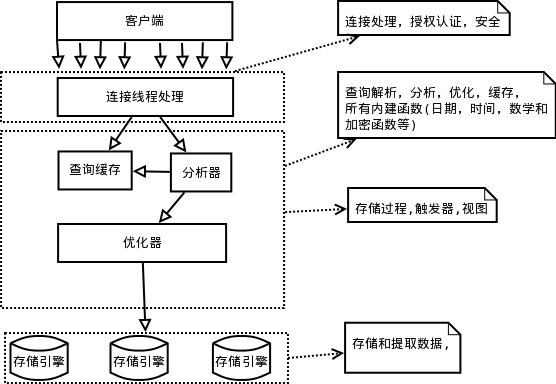
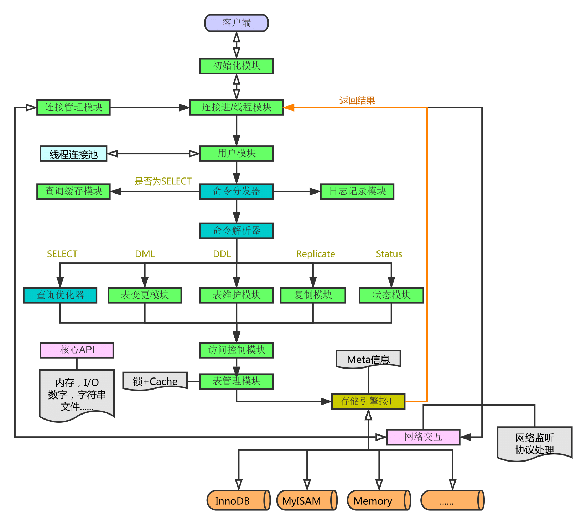

## MySQL架构

MySQL的逻辑架构：

MySQL的逻辑架构分为三层：

1. 第一层是客户端的连接层，这个模块的主要功能是：身份认证、连接线程池、线程复用等功能

2. 第二层是MySQL的服务层，包含MySQL的大多数核心功能。主要包括:查询缓存(Caches & buffers)、分析器(SQL Parser)、优化器(Optimizer)、MySQL Managerment Server & Utilities(系统管理)、SQL Interface(SQL接口)

3. 第三层是MySQL的存储引擎层。MySQL的存储引擎是MySQL数据库非常重要的一个特点，其特殊之处在于插件式的表存储引擎。因为MySQL数据库是开源的，用户可以根据MySQL预定义的存储引擎接口编写自己的存储引擎。关于"如何实现一个自己的存储引擎"，可以参考MySQL开发者网站给出的

   [教程]: https://dev.mysql.com/doc/internals/en/custom-engine.html

   

